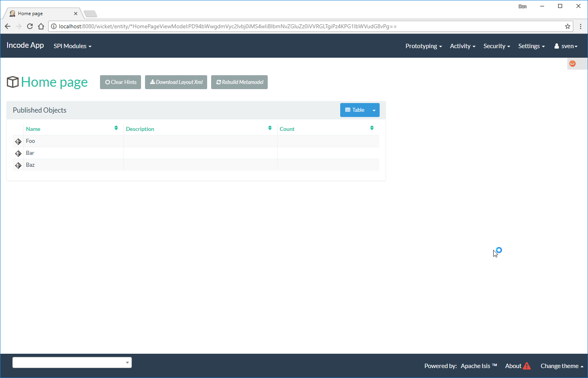
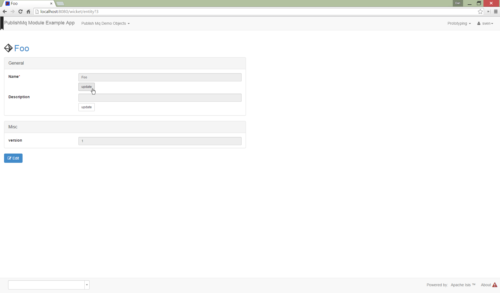
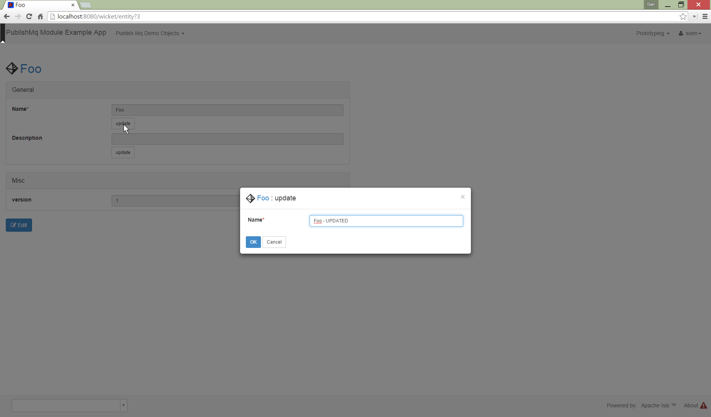
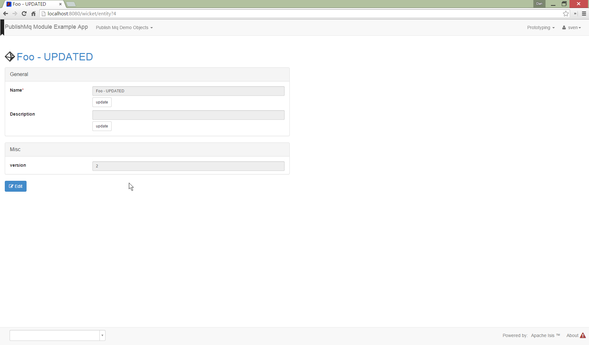
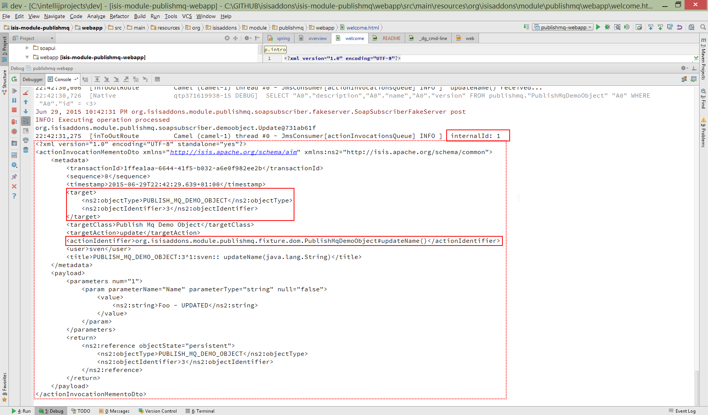
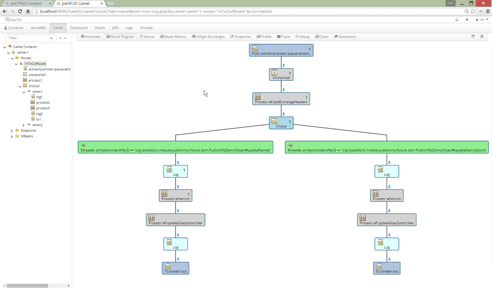

= isis-module-publishmq
:_basedir: ../../../
:_imagesdir: images/

image:https://travis-ci.org/isisaddons/isis-module-publishmq.png?branch=master[Build Status,link=https://travis-ci.org/isisaddons/isis-module-publishmq]

This module, intended for use with http://isis.apache.org[Apache Isis], provides an implementation of Apache Isis` link:http://isis.apache.org/guides/rg.html#_rg_services-spi_manpage-PublishingService[`PublishingService`] SPI that submits an XML representation of an link:https://github.com/apache/isis/blob/master/core/schema/src/main/resources/org/apache/isis/schema/ixn/ixn.xsd[`MemberInteractionDto`]s to an link:http://activemq.apache.org[ActiveMQ] queue.

The example app itself also demonstrates how this member interaction event (action invocation or property edit) can
be routed using link:http://camel.apache.org[Apache Camel]:

* the payload is enriched using Apache Isis' own link:http://isis.apache.org/guides/ug.html#_ug_restfulobjects-viewer[Restful Objects] viewer (obtaining additional information).
* the enriched message is used to post to a (fake) external SOAP, eg representing a General Ledger.

In addition, the example app configures link:https://jolokia.org/[Jolokia], allowing the ActiveMQ, Camel and other JMX beans to be administered from an external console such as link:hawt.io[Hawt.io].

The diagram below shows the moving parts:

image::webapp/src/main/webapp/images/overview.png[link="https://raw.githubusercontent.com/isisaddons/isis-module-publishmq/master/webapp/src/main/webapp/images/overview.png"]

One of the design objectives for the PublishMq module is to allow the ActiveMQ queue (and therefore any Camel routing) to be either embedded (as in the example app) or to be remote.  This is one of the reasons why the payload posted to the queue is the XML representation of a JAXB object (the `InvocationDto`).

To make the example app easier to run, the fake SOAP service representing the external system is actually deployed as a CXF servlet within the example app itself, mounted at `/soap/ExternalSystemAdapter/DemoObject`.   It exposes an API for the Camel routing to post to, and also exposes a query API that simply lists the messages received.  Of course, "in real life" this external system would be running somewhere else on the network (as the diagram shows).

== Application walk-through

The following screenshots show how the publishing service publishes the member interaction events that are then routed
through to the (fake) external system using Camel.

=== Installing the Fixture Data

First, install sample data:

This returns the first demo object (an instance of `PublishMqDemoObject`):

=== Invoke an action

The `updateName()` action is defined as:

[source,java]
----
@Action(
    semantics = SemanticsOf.IDEMPOTENT,
    publishing = Publishing.ENABLED     // <1>
)
public PublishMqDemoObject updateName(
        @ParameterLayout(named="Name") final String name) {
    setName(name);
    return this;
}
----
<1> invocations of this action will be published to the configured implementation of `PublishingService`.

Invoke the action:

the value of the `name` property should, of course, be updated:

=== Camel routing

The example app defines the following Camel route (link:fixture/routing/src/main/resources/camel-config.xml[camel-config.xml]):

[source,xml]
----
<camelContext xmlns="http://camel.apache.org/schema/spring">
  <route id="updateFakeSoapServiceRoute">
    <from uri="activemq-broker:queue:memberInteractionsQueue"/>                 <!-- 1 -->
    <unmarshal>
      <jaxb contextPath="org.apache.isis.schema.ixn.v1" prettyPrint="true"/>    <!-- 2 -->
    </unmarshal>
    <camel:process ref="addExchangeHeaders"/>                                   <!-- 3 -->
    <camel:choice>
      <camel:when>                                                              <!-- 4 -->
        <camel:simple>                                                          <!-- 5 -->
          ${header.ixn[execution$memberIdentifier]} ==
          'org.isisaddons.module.publishmq.fixture.dom.PublishMqDemoObject#updateName()'
        </camel:simple>
        <log message="updateName() received... "/>
        <camel:process ref="attachDomCanonicalDtoUsingRestfulObjects"/>         <!-- 6 -->
        <camel:process ref="postToFakeExternalSoapService"/>                    <!-- 7 -->
        <log message="internalId: ${header.externalSystemInternalId}"/>         <!-- 8 -->
        <camel:to uri="stream:out"/>                                            <!-- 9 -->
      </camel:when>
      <camel:when>
        ...
      </camel:when>
    </camel:choice>
  </route>
</camelContext>
----
<1> subscribe to ActiveMQ for incoming member interaction events (in XML form).  This uses the internal `vm://` protocol for speed
<2> unmarshal to a (JAXB annotated) `InteractionDto` object
<3> using the `AddExchangeHeaders` component provided by this module to add the metadata from the `InteractionDto` to the Camel message.  This allows the message to be routed
<4> use Camel to select which sub-route to following, using...
<5> ... the header attached earlier.  The action identifier header is usually used as the predicate for selecting the sub-route
<6> Use a processor (implemented in the example app) to attach a DTO obtained from a call to Restful Objects.
<7> Use a processor (implemented in the example app) to post a message to the fake external SOAP service.
<8> Log the id allocated by the fake server to the console.  This will increment for each call
<9> Log the message payload to the console.  Note that this does not include any attachments

The referenced beans are defined as:

[source,xml]
----
<bean id="activemq-broker"
      class="org.apache.activemq.camel.component.ActiveMQComponent">
    <property name="brokerURL" value="vm://broker?create=false&amp;waitForStart=5000"/>
</bean>
<bean id="addExchangeHeaders"
      class="org.isisaddons.module.publishmq.dom.camel.AddExchangeHeaders"/>   <!--1-->
<bean id="attachDomCanonicalDtoUsingRestfulObjects"
     class="org.isisaddons.module.publishmq.fixture.routing.AttachDemoObjectDto"
     init-method="init">                                                       <!--2-->
    <property name="base" value="${attachDomCanonicalDto.base}"/>
    <property name="username" value="${attachDomCanonicalDto.username}"/>
    <property name="password" value="${attachDomCanonicalDto.password}"/>
</bean>
<bean id="postToFakeExternalSoapService"
      class="org.isisaddons.module.publishmq.fixture.routing.PostToExternalWebServiceUsingSoap"
      init-method="init">                                                     <!--3-->
    <property name="endpointAddressBase"
              value="${updateExternalSystemAdapter.endpointAddressBase}"/>
    <property name="endpointAddressSuffix"
              value="${updateExternalSystemAdapter.endpointAddressSuffix}"/>
</bean>
----
<1> adds the exchange headers for routing (step 3 in the route, above)
<2> calls Restful Objects to obtain a DTO representing the updated entity (step 6 in the route)
<3> calls fake SOAP service (step 7 in the route)

There are two observable side-effects from the execution of this route.  Firstly, when the fake SOAP service is
called, it should return an internal Id.  This, along with the rest of the message payload, are logged to the console:

The screenshot also highlights the two important pieces of information used by the route: the member identifier metadata -- added as a Camel header for routing -- and the target object has was updated.

Second, we can query the fake SOAP service to se the data that was posted to it.  The screenshot below uses link:http://www.soapui.org/[SOAP UI], which can generate stub requests from the fake SOAP service's WSDL (http://localhost:8080/soap/ExternalSystemAdapter/DemoObject?wsdl[http://localhost:8080/soap/ExternalSystemAdapter/DemoObject?wsdl]):

image::images/060-query-fake-server.png[width=800,height=469,link="https://raw.githubusercontent.com/isisaddons/isis-module-publishmq/master/images/060-query-fake-server.png"]

[WARNING]
====
The above screenshot is out-of-date, showing the format of the `aim.xsd` for 1.12.x, rather than `ixn.xsd` for 1.13.x
====

=== Proxying the REST and SOAP calls

To see in a little more detail what the `attachDtoFromRestfulObjects` and `postToFakeExternalSoapService` processors actually do, we can use the venerable link:http://ws.apache.org/tcpmon/download.cgi[tcpmon] to act as a proxy.  For example, we can set up port 6060 to forward onto port 8080:

image::images/110-proxy-restful-objects.png[width=800,height=469,link="https://raw.githubusercontent.com/isisaddons/isis-module-publishmq/master/images/110-proxy-restful-objects.png"]

We can similarly do the same for port 7070, also forwarding onto port 8080.

Then, we can reconfigure the app to use these different ports by editing link:webapp/src/main/resources/spring.properties[`spring.properties`]:

[source,ini]
----
attachDomCanonicalDto.base=http://localhost:6060/restful/
updateExternalSystemAdapter.endpointAddressBase=http://localhost:7070/soap/
...
----

When we run once more, we can see that the `attachDtoFromRestfulObjects` processor uses conneg support to obtain a specific canonical DTO that represents the original `PublishedMqDemoObject` entity:

image::images/120-conneg.png[width=800,height=469,link="https://raw.githubusercontent.com/isisaddons/isis-module-publishmq/master/images/120-conneg.png"]

Using DTOs in this way is important because we want the Camel event bus logic to be decoupled from changes to the
internals of the Apache Isis app.  As the screenshot shows, the processor specifies an HTTP Accept header.  The
Restful Objects viewer delegates to the configured
link:http://isis.apache.org/guides/rg.html#_rg_services-spi_manpage-ContentNegotiationService[`ContentNegotiationService`]
SPI, which knows how to map the `PublishedMqDemoObject` entity into the requested `DemObjectDto` DTO:

[source,java]
----
@DomainService(nature = NatureOfService.DOMAIN)
public class PublishMqDemoContentMappingService implements ContentMappingService {
    public Object map(
            final Object object,
            final List<MediaType> acceptableMediaTypes) {
        if(object instanceof PublishMqDemoObject) {
            final PublishMqDemoObject demoObject = (PublishMqDemoObject) object;
            final Bookmark bookmark = bookmarkService.bookmarkFor(object);
            final DemoObjectDto dto = new DemoObjectDto();
            dto.setName(demoObject.getName());
            dto.setDescription(demoObject.getDescription());
            final OidDto oidDto = bookmark.toOidDto();
            dto.setOid(oidDto);
            return dto;
        }
        return null;
    }
    @javax.inject.Inject
    private BookmarkService bookmarkService;
}
----

The call to the fake SOAP service meanwhile is more straightforward: we observe just the regular SOAP messages (the
implementation uses `wsdl2java` to create stubs, so the code is very straightforward):

image::images/210-proxy-soapservice.png[width=800,height=469,link="https://raw.githubusercontent.com/isisaddons/isis-module-publishmq/master/images/210-proxy-soapservice.png"]

=== Jolokia and Hawt.io

As mentioned in the introduction, the example app also configures Jolokia so that consoles such as Hawt.io can be used to monitor/administer internal JMX beans (including ActiveMQ and Camel).

Configuring Jolokia itself turns out to be as simple as updating the classpath and adding its servlet to the `web.xml`:

[source,xml]
----
<servlet>
    <servlet-name>jolokia-agent</servlet-name>
    <servlet-class>org.jolokia.http.AgentServlet</servlet-class>
    <init-param>
        <param-name>discoveryEnabled</param-name>
        <param-value>false</param-value>
    </init-param>
    <init-param>
        <param-name>agentDescription</param-name>
        <param-value>Apache ActiveMQ</param-value>
    </init-param>
    <load-on-startup>1</load-on-startup>
</servlet>
<servlet-mapping>
    <servlet-name>jolokia-agent</servlet-name>
    <!-- using same convention as standalone ActiveMQ -->
    <url-pattern>/api/jolokia/*</url-pattern>
</servlet-mapping>
----

With this done, we can use Hawt.io to connect to the service:

image::images/310-connect-activemq.png[width=800,height=469,link="https://raw.githubusercontent.com/isisaddons/isis-module-publishmq/master/images/310-connect-activemq.png"]

Hawt.io itself runs as a separate webapp.  For testing purposes, it can also be run from the command line, eg:

[source,bash]
----
java -jar hawtio-app-1.4.51.jar --port 9090
----

=== Monitoring ActiveMQ and Camel

Once connected we can navigate to the ActiveMQ tab:

image::images/320-monitor-activemq.png[width=800,height=469,link="https://raw.githubusercontent.com/isisaddons/isis-module-publishmq/master/images/320-monitor-activemq.png"]

and similarly to the Camel tab:

== How to run the Demo App

The prerequisite software is:

* Java JDK 7 (nb: Isis currently does not support JDK 8)
* http://maven.apache.org[maven 3] (3.2.x or later is recommended).

To build the demo app:

[source]
----
git clone https://github.com/isisaddons/isis-module-publishmq.git
mvn clean install
----

To run the demo app:

[source]
----
mvn antrun:run -P self-host
----

Then log on using user: `sven`, password: `pass`

If you want to proxy the Restful Objects and/or fake SOAP servers, then update `spring.properties` and run `tcpmon` or similar (as shown in the app walkthrough, above).

Hawt.io is a standalone utility that is _not_ integrated into the example webapp; if you want to run it then specify `--port` so that it runs on some other port than its default, 8080.

== How to configure/use

You can either use this module "out-of-the-box", or you can fork this repo and extend to your own requirements.

The module itself consists of submodules:

* `dom-servicespi`, containing the `PublishingService` SPI implementation
* `dom-camel`, that provides utility class to help route messages.
* `dom`, parent module

=== "Out-of-the-box"

To use "out-of-the-box":

* update your classpath by adding importing the parent module's dependency into in your parent module's `pom.xml`: +
+
[source,xml]
----
<dependencyManagement>
    <dependencies>
        <dependency>
            <groupId>${project.groupId}</groupId>
            <artifactId>isis-module-publishmq-dom</artifactId>
            <version>1.14.0</artifactId>
            <type>pom</type>
            <scope>import</scope>
        </dependency>
        ...
    </dependencies>
</dependencyManagement>
----

* if using `AppManifest`, then update its `getModules()` method: +

[source,xml]
----
    @Override
    public List<Class<?>> getModules() {
        return Arrays.asList(
                ...
                org.isisaddons.module.publishmq.PublishMqModule.class,
                ...
        );
    }
----

* otherwise, in your project's `webapp` module, update your `WEB-INF/isis.properties`. +
+
[source,xml]
----
  isis.services.ServicesInstallerFromAnnotation.packagePrefix=\
                                ...\
                                org.isisaddons.module.publishmq.dom,\
                                ...
----
+
You might also need to specify the package for any new services that you have written, eg implementation of `ContentNegotiationService` or similar.

* update your classpath by adding importing the `-dom-servicespi` dependency in your project's `dom` module's `pom.xml`: +
+
[source,xml]
----
<dependencies>
    <dependency>
        <groupId>org.isisaddons.module.publishmq</groupId>
        <artifactId>isis-module-publishmq-dom-servicespi</artifactId>
    </dependency>
    ...
</dependencies>
----

* if you are using Camel for routing and want to use the `AddExchangeHeaders` utility class, then -- in the appropriate module within your app -- add the dependency: +
+
[source,xml]
----
<dependencies>
    <dependency>
        <groupId>org.isisaddons.module.publishmq</groupId>
        <artifactId>isis-module-publishmq-dom-camel</artifactId>
    </dependency>
    ...
</dependencies>
----
+
In the example app all the Camel routing can be found in the `-fixture-routing` module.

* configure ActiveMQ so that the publishing service implementation can post to a queue called `memberInteractionsQueue`. +
+
In the example app this is done using Spring (link:webapp/src/main/resources/activemq-config.xml[activemq-config.xml]):
+
[source,xml]
----
<beans
  xmlns="http://www.springframework.org/schema/beans"
  xmlns:xsi="http://www.w3.org/2001/XMLSchema-instance"
  xsi:schemaLocation="http://www.springframework.org/schema/beans http://www.springframework.org/schema/beans/spring-beans.xsd
  http://activemq.apache.org/schema/core http://activemq.apache.org/schema/core/activemq-core.xsd">
    <broker xmlns="http://activemq.apache.org/schema/core"
            brokerName="broker"
            dataDirectory="${activemq.data}"
            useShutdownHook="false"
            useJmx="true"
            >
        ...
        <destinations>
            <queue physicalName="memberInteractionsQueue"/>
        </destinations>
        ...
    </broker>
</beans>
----
+
This is bootstrapped in the `web.xml`:
+
[source,xml]
----
<listener>
    <listener-class>org.springframework.web.context.ContextLoaderListener</listener-class>
</listener>
<context-param>
    <param-name>contextConfigLocation</param-name>
    <param-value>
        classpath:activemq-config.xml
    </param-value>
</context-param>
----

Notes:

* Check for later releases by searching http://search.maven.org/#search|ga|1|isis-module-publishmq-dom[Maven Central Repo].

==== "Out-of-the-box" (-SNAPSHOT)

If you want to use the current `-SNAPSHOT`, then the steps are the same as above, except:

* when updating the classpath, specify the appropriate -SNAPSHOT version:

[source,xml]
----
<version>1.15.0-SNAPSHOT</version>
----

* add the repository definition to pick up the most recent snapshot (we use the Cloudbees continuous integration service).  We suggest defining the repository in a `<profile>`:

[source,xml]
----
<profile>
    <id>cloudbees-snapshots</id>
    <activation>
        <activeByDefault>true</activeByDefault>
    </activation>
    <repositories>
        <repository>
            <id>snapshots-repo<;/id>
            <url>http://repository-estatio.forge.cloudbees.com/snapshot/</url>
            <releases>
                <enabled>false>/enabled>
            </releases>
            <snapshots>
                <enabled>true</enabled>
            </snapshots>
        </repository>
    </repositories>
</profile>
----

=== Forking the repo

If instead you want to extend this module's functionality, then we recommend that you fork this repo. The repo is
structured as follows:

* `pom.xml` - parent pom
* `dom` - the module implementation, itself a parent with submodules:
** `dom-servicespi` - the implementation of `PublishingServiceUsingActiveMq`; depends on the Apache Isis applib
** `dom-camel` - providing the `AddExchangeHeaders` utility for routing messages using Camel
* `fixture` - fixtures, itself a parent with submodules:
** `fixture-dom` - holding a sample domain objects; depends on `dom-servicespi`
** `fixture-scripts` - holding sample fixture (data) setup scripts
** `fixture-canonical` - defines the canonical `DemoObjectDto`, as queried for using Restful Objects.  This uses `xjc` to convert the XSD into the Java DTO.
** `fixture-canonicalmappings` - contains the implementation of `ContentMappingService` to map the `PublishMqDemoObject` entity to `DemoObjectDto` DTO
** `fixture-routing` - contains the example Camel rout
* `externalsystemadapter` - parent module for the fake external system exposing a SOAP web service:
** `externalsystemadapter-wsdl` - defines the WSDL for the fake SOAP service
** `externalsystemadapter-wsdlgen` - generates the stub classes for both client and server
** `externalsystemadapter-fakeserver` - implementation of the fake server (embedded in the example webapp for convenience/testing)
* `integtests` - (TODO) integration tests for the module; depends on `fixture-dom`
* `webapp` - demo webapp (see above screenshots); depends on `dom` and `fixture`

Only the `dom` module (with its submodules) is released to Maven Central Repo. The versions of the other modules are purposely left at `0.0.1-SNAPSHOT` because they are not intended to be released.

== Also of note

The example app contains a few other little tricks that may be useful if you are looking to deploy a similar architecture for your own application.

=== Generate Canonical DTO referencing Apache Isis' DTOs

As of 1.13.0 Apache Isis includes the link:http://isis.apache.org/schema/ixn/ixn.xsd[`ixn.xsd`] (member interaction)
schema (replacing and generalizing the `aim.xsd` provided from 1.9.0 through 1.12.x).  The `PublishingServiceMq` uses
this `ixn.xsd` schema (or rather, its Java JAXB equivalent, `InteractionDto`), directly.

The similar `common.xsd` is _also_ used by the demo app in the construction of its own canonical `DemoObjectDto` (use of
`OidDto` to represent a bookmark to a published domain object).

=== Centralized Spring configuration

In the example app Spring is used to bootstrap ActiveMQ (link:webapp/src/main/resources/activemq-config.xml[`activemq-config.xml`]), and Camel (link:fixture/routing/src/main/resources/camel-config.xml[`camel-config.xml`]), and also the fake SOAP Subscriber (link:webapp/src/main/resources/externalSystemFakeServer-config.xml[`externalSystemFakeServer-config.xml`]).  The configuration for all is centralized through a propertyPlaceholderConfigurer bean (defined in link:webapp/src/main/resources/propertyPlaceholderConfigurer-config.xml#L23[`propertyPlaceholderConfigurer-config.xml`]).

The location of the property file is specified in the link:webapp/src/main/webapp/WEB-INF/web.xml#L44[`web.xml`]:

[source,xml]
----
<context-param>
    <param-name>spring.config.file</param-name>
    <param-value>classpath:spring.properties</param-value>
</context-param>
----

where link:webapp/src/main/resources/spring.properties[`spring.properties`] is:

[source,ini]
----
activemq.data=activemq-data
enrichWithCanonicalDto.base=http://localhost:8080/restful/
enrichWithCanonicalDto.username=sven
enrichWithCanonicalDto.password=pass
updateExternalSystemAdapter.endpointAddress=http://localhost:8080/soap/ExternalSystemAdapter/DemoObject
----

If necessary the location of this config file can be overridden; see link:http://isis.apache.org/guides/ug.html#_ug_deployment_externalized-configuration[this topic] in the Apache Isis user guide.

=== WSDL to Java

Similar to the way in which the .xsd schemas are converted to Java, `wsdl2java` is used to convert the fake server's WSDL to Java stubs.  This WSDL can be found link:externalsystemadapter/wsdl/src/main/resources/org/isisaddons/module/publishmq/externalsystemadapter/wsdl/DemoObject.wsdl[here]; the `pom.xml` configuration can be found link:https://github.com/isisaddons/isis-module-publishmq/blob/master/externalsystemadapter/wsdlgen/pom.xml#L76[here].

== Related Modules/Services

The http://github.com/isisaddons/isis-module-publishing[Isis addons' publishing] module provides an alternative implementation of `PublishingService` SPI that publishes to a database table.

== Known issues

None at this time.

== Change Log

* `1.13.0` - released against Isis 1.13.0
* `1.12.0` - released against Isis 1.12.0
* `1.11.0` - released against Isis 1.11.0
* `1.10.0` - released against Isis 1.10.0
* `1.9.0` - released against Isis 1.9.0

== Legal Stuff

=== License

[source]
----
Copyright 2015 Dan Haywood

Licensed under the Apache License, Version 2.0 (the
"License"); you may not use this file except in compliance
with the License.  You may obtain a copy of the License at

    http://www.apache.org/licenses/LICENSE-2.0

Unless required by applicable law or agreed to in writing,
software distributed under the License is distributed on an
"AS IS" BASIS, WITHOUT WARRANTIES OR CONDITIONS OF ANY
KIND, either express or implied.  See the License for the
specific language governing permissions and limitations
under the License.
----

=== Dependencies

The module depends on link:http://activemq.apache.org[ActiveMQ] and also link:http://camel.apache.org[Camel].  The latter can be considered optional, because that dependency only provides a supporting utility class (`AddExchangeHeaders`).

== Maven deploy notes

Only the `dom` module is deployed, and is done so using Sonatype's OSS support (see
http://central.sonatype.org/pages/apache-maven.html[user guide]).

=== Release to Sonatype's Snapshot Repo

To deploy a snapshot, use:

[source]
----
pushd dom
mvn clean deploy
popd
----

The artifacts should be available in Sonatype's
https://oss.sonatype.org/content/repositories/snapshots[Snapshot Repo].

=== Release an Interim Build

If you have commit access to this project (or a fork of your own) then you can create interim releases using the `interim-release.sh` script.

The idea is that this will - in a new branch - update the `dom/pom.xml` with a timestamped version (eg `1.13.0.20161017-0738`).
It then pushes the branch (and a tag) to the specified remote.

A CI server such as Jenkins can monitor the branches matching the wildcard `origin/interim/*` and create a build.
These artifacts can then be published to a snapshot repository.

For example:

[source]
----
sh interim-release.sh 1.15.0 origin
----

where

* `1.15.0` is the base release
* `origin` is the name of the remote to which you have permissions to write to.

=== Release to Maven Central

The `release.sh` script automates the release process. It performs the following:

* performs a sanity check (`mvn clean install -o`) that everything builds ok
* bumps the `pom.xml` to a specified release version, and tag
* performs a double check (`mvn clean install -o`) that everything still builds ok
* releases the code using `mvn clean deploy`
* bumps the `pom.xml` to a specified release version

For example:

[source]
----
sh release.sh 1.14.0 \
              1.15.0-SNAPSHOT \
              dan@haywood-associates.co.uk \
              "this is not really my passphrase"
----

where
* `$1` is the release version
* `$2` is the snapshot version
* `$3` is the email of the secret key (`~/.gnupg/secring.gpg`) to use for signing
* `$4` is the corresponding passphrase for that secret key.

Other ways of specifying the key and passphrase are available, see the `pgp-maven-plugin`'s
http://kohsuke.org/pgp-maven-plugin/secretkey.html[documentation]).

If the script completes successfully, then push changes:

[source]
----
git push origin master && git push origin 1.14.0
----

If the script fails to complete, then identify the cause, perform a `git reset --hard` to start over and fix the issue
before trying again. Note that in the `dom`'s `pom.xml` the `nexus-staging-maven-plugin` has the
`autoReleaseAfterClose` setting set to `true` (to automatically stage, close and the release the repo). You may want
to set this to `false` if debugging an issue.

According to Sonatype's guide, it takes about 10 minutes to sync, but up to 2 hours to update http://search.maven.org[search].