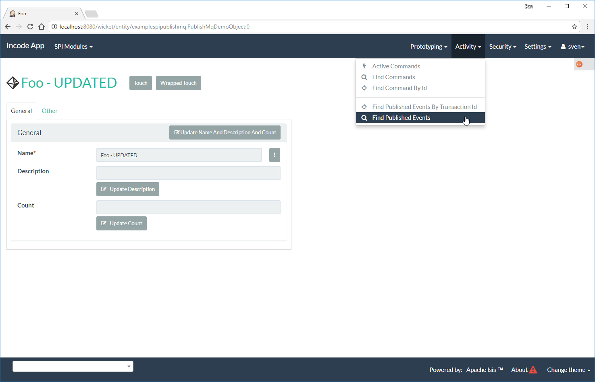
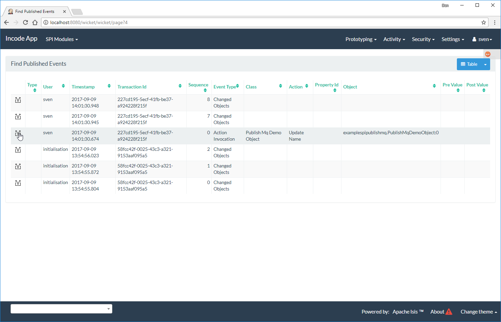
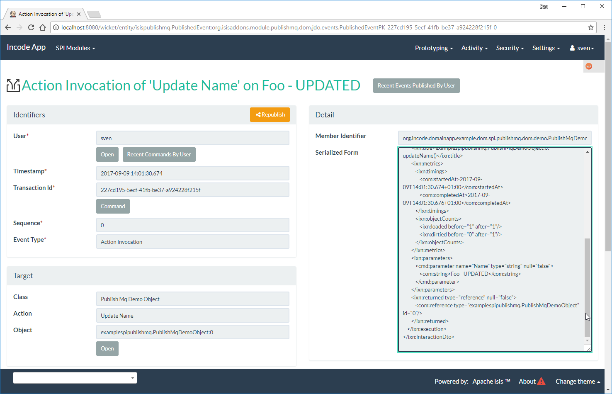

[[spi-publishmq]]
= PublishMQ SPI Implementation
:_basedir: ../../../
:_imagesdir: images/
:generate_pdf:
:toc:

This module (`isis-module-publishmq`) provides an implementation of Apache Isis' link:http://isis.apache.org/guides/rgsvc/rgsvc.html#_rgsvc_persistence-layer-spi_PublisherService[`PublisherService`] SPI that submits an XML representation of an link:https://github.com/apache/isis/blob/master/core/schema/src/main/resources/org/apache/isis/schema/ixn/ixn.xsd[`MemberInteractionDto`]s to an link:http://activemq.apache.org[ActiveMQ] queue.

The xref:../../../quickstart/quickstart-with-example-usage.adoc#[quickstart] app also demonstrates how this member interaction event (action invocation or property edit) can be routed using link:http://camel.apache.org[Apache Camel], whereby the payload is enriched using Apache Isis' own link:http://isis.apache.org/guides/ug.html#_ug_restfulobjects-viewer[Restful Objects] viewer (obtaining additional information);

The diagram below shows the moving parts:

image::{_imagesdir}overview.png[width="600px",link="{_imagesdir}overview.png"]

One of the design objectives for the PublishMq module is to allow the ActiveMQ queue (and therefore any Camel routing) to be either embedded (as in the example app) or to be remote.
This is one of the reasons why the payload posted to the queue is the XML representation of a JAXB object (the `InvocationDto`).

[NOTE]
====
Note that the example app does _not_ include an external system (General Ledger in the diagram), ie step #12.
====

== Screenshots

The module's functionality can be explored by running the xref:../../../quickstart/quickstart-with-example-usage.adoc#[quickstart with example usage] using the `org.incode.domainapp.example.app.modules.ExampleDomSpiPublishMqAppManifest`.

A home page is displayed when the app is run:

image::{_imagesdir}010-install-fixtures.png[width="600px",link="{_imagesdir}010-install-fixtures.png"]

This returns the first demo object (an instance of `PublishMqDemoObject`):

image::{_imagesdir}020-update-demo-object.png[width="600px",link="{_imagesdir}020-update-demo-object.png"]

=== Invoke an action

The `updateName()` action is defined as:

[source,java]
----
@Action(
    semantics = SemanticsOf.IDEMPOTENT,
    publishing = Publishing.ENABLED     // <1>
)
public PublishMqDemoObject updateName(
        @ParameterLayout(named="Name") final String name) {
    setName(name);
    return this;
}
----
<1> invocations of this action will be published to the configured implementation of `PublishingService`.

Invoke the action:

image::{_imagesdir}030-update-demo-object.png[width="600px",link="{_imagesdir}030-update-demo-object.png"]

the value of the `name` property should, of course, be updated:

image::images/040-demo-object-updated.png[width="600px",link="images/040-demo-object-updated.png"]

From the activity menu the published events (also persisted as entities) can be inspected:

\... one of which is to update the name:

The published entity contains XML which captures the details of the member interaction:

== How to configure/use

You can either use this module "out-of-the-box", or you can fork this repo and extend to your own requirements.

The module itself consists of several submodules:

* the `publishmq-dom-servicespi` submodule

+
which contains the `PublishingService` SPI implementation that actually publishes to an ActiveMQ queue

* the (optional, but recommended) `publishmq-dom-jdo` submodule

+
which allows published events to be persisted as `PublishedEvent` entities

* the (optional) `publishmq-dom-camel` submodule

+
which provides utility class to help route messages

* the (optional) `publishmq-dom-statusclient`

+
that provides utility classes to log status messages with the originating system via the RestfulObjects viewer's REST API.

=== Classpath

Update your classpath:

* by adding importing the parent module's dependency into in your parent module's `pom.xml`: +
+
[source,xml]
----
<dependencyManagement>
    <dependencies>
        <dependency>
            <groupId>org.isisaddons.module.publishmq</groupId>
            <artifactId>isis-module-publishmq-dom</artifactId>
            <version>1.15.1.1</version>
            <type>pom</type>
            <scope>import</scope>
        </dependency>
        ...
    </dependencies>
</dependencyManagement>
----

* by adding the `-dom-servicespi` dependency in your project's `dom` module's `pom.xml`: +
+
[source,xml]
----
<dependencies>
    <dependency>
        <groupId>org.isisaddons.module.publishmq</groupId>
        <artifactId>isis-module-publishmq-dom-servicespi</artifactId>
    </dependency>
    ...
</dependencies>
----

* (if you are using Camel for routing and want to use the `AddExchangeHeaders` utility class) by adding (in the appropriate module within your app) the dependency: +
+
[source,xml]
----
<dependencies>
    <dependency>
        <groupId>org.isisaddons.module.publishmq</groupId>
        <artifactId>isis-module-publishmq-dom-camel</artifactId>
    </dependency>
    ...
</dependencies>
----

[TIP]
====
Note that the xref:../../../quickstart/quickstart-with-embedded-camel.adoc#[quickstart with embedded camel] configures this already, so use as a guide if need be.
====

Check for later releases by searching http://search.maven.org/#search|ga|1|isis-module-publishmq-dom[Maven Central Repo].

For instructions on how to use the latest `-SNAPSHOT`, see the xref:../../../pages/contributors-guide.adoc#[contributors guide].

=== Bootstrapping

In the `AppManifest`, update its `getModules()` method, eg:

[source,xml]
----
    @Override
    public List<Class<?>> getModules() {
        return Arrays.asList(
                ...
                org.isisaddons.module.publishmq.PublishMqModule.class,
                ...
        );
    }
----

You might also need to specify the package for any new services that you have written, eg implementation of `ContentNegotiationService` or similar.

=== Configure ActiveMQ

Configure ActiveMQ so that the publishing service implementation can post to a queue called `memberInteractionsQueue`.

In the xref:../../../quickstart/quickstart-with-embedded-camel.adoc#[quickstart with embedded camel] app this is done using Spring (link:webapp/src/main/resources/activemq-config.xml[activemq-config.xml]):
+
[source,xml]
----
<beans
  xmlns="http://www.springframework.org/schema/beans"
  xmlns:xsi="http://www.w3.org/2001/XMLSchema-instance"
  xsi:schemaLocation="http://www.springframework.org/schema/beans http://www.springframework.org/schema/beans/spring-beans.xsd
  http://activemq.apache.org/schema/core http://activemq.apache.org/schema/core/activemq-core.xsd">
    <broker xmlns="http://activemq.apache.org/schema/core"
            brokerName="broker"
            dataDirectory="${activemq.data}"
            useShutdownHook="false"
            useJmx="true"
            >
        ...
        <destinations>
            <queue physicalName="memberInteractionsQueue"/>
        </destinations>
        ...
    </broker>
</beans>
----

This is bootstrapped in the `web.xml`:

[source,xml]
----
<listener>
    <listener-class>org.springframework.web.context.ContextLoaderListener</listener-class>
</listener>
<context-param>
    <param-name>contextConfigLocation</param-name>
    <param-value>
        classpath:activemq-config.xml
    </param-value>
</context-param>
----

== Canonical DTOs

The xref:../../../quickstart/quickstart-with-embedded-camel.adoc#[quickstart with embedded camel] app contains a few other little tricks that may be useful if you are looking to deploy a similar architecture for your own application.

=== Generate Canonical DTO referencing Apache Isis' DTOs

As of 1.13.0 Apache Isis includes the link:http://isis.apache.org/schema/ixn/ixn.xsd[`ixn.xsd`] (member interaction) schema (replacing and generalizing the `aim.xsd` provided from 1.9.0 through 1.12.x).
The `PublishingServiceMq` uses this `ixn.xsd` schema (or rather, its Java JAXB equivalent, `InteractionDto`), directly.

The similar `common.xsd` is _also_ used by the demo app in the construction of its own canonical `DemoObjectDto` (use of `OidDto` to represent a bookmark to a published domain object).

=== Centralized Spring configuration

In the example app Spring is used to bootstrap ActiveMQ (link:webapp/src/main/resources/activemq-config.xml[`activemq-config.xml`]), and Camel (link:fixture/routing/src/main/resources/camel-config.xml[`camel-config.xml`]), and also the fake SOAP Subscriber (link:webapp/src/main/resources/externalSystemFakeServer-config.xml[`externalSystemFakeServer-config.xml`]).
The configuration for all is centralized through a propertyPlaceholderConfigurer bean (defined in link:webapp/src/main/resources/propertyPlaceholderConfigurer-config.xml#L23[`propertyPlaceholderConfigurer-config.xml`]).
The location of the property file is specified in the link:webapp/src/main/webapp/WEB-INF/web.xml#L44[`web.xml`]:

[source,xml]
----
<context-param>
    <param-name>spring.config.file</param-name>
    <param-value>classpath:spring.properties</param-value>
</context-param>
----

where link:webapp/src/main/resources/spring.properties[`spring.properties`] is:

[source,ini]
----
activemq.data=activemq-data
enrichWithCanonicalDto.base=http://localhost:8080/restful/
enrichWithCanonicalDto.username=sven
enrichWithCanonicalDto.password=pass
updateExternalSystemAdapter.endpointAddress=http://localhost:8080/soap/ExternalSystemAdapter/DemoObject
----

If necessary the location of this config file can be overridden; see link:http://isis.apache.org/guides/ug.html#_ug_deployment_externalized-configuration[this topic] in the Apache Isis user guide.

== Known issues

None known at this time.

== Dependencies

In addition to Apache Isis, this module also depends upon:

* link:http://activemq.apache.org[ActiveMQ]

* (optional) link:http://camel.apache.org[Camel] +
+

== Dependencies

The publishmq module actually consists of four distinct submodules, which can be used to some extend independently.

=== publishmq/servicespi

Maven can report modules dependencies of this submodule using:

[source,bash]
----
mvn dependency:list -o -pl modules/spi/publishmq/impl/servicespi -D excludeTransitive=true
----

which, excluding Incode Platform and Apache Isis modules, returns these compile/runtime dependencies:

[source,bash]
----
org.apache.activemq:activemq-all:jar:5.11.1
----

For further details on 3rd-party dependencies, see:

* link:http://activemq.apache.org[Apache ActiveMQ]

=== publishmq/jdo

This submodule can be considered optional (though its use _is_ recommended).
If not included then published messages are simply not persisted as JDO entities.

Maven can report modules dependencies of this submodule using:

[source,bash]
----
mvn dependency:list -o -pl modules/spi/publishmq/impl/jdo -D excludeTransitive=true
----

which, excluding Incode Platform and Apache Isis modules, returns these compile/runtime dependencies:

[source,bash]
----
org.slf4j:slf4j-api:jar:1.7.21
----

From the Incode Platform it uses:

* `publishmq/servicespi` submodule, above.

For further details on 3rd-party dependencies, see:

* link:https://www.slf4j.org/[Slf4J]

=== publishmq/camel

This submodule is considered optional because it merely provides a supporting utility class (`AddExchangeHeaders`).

Maven can report modules dependencies of this submodule using:

[source,bash]
----
mvn dependency:list -o -pl modules/spi/publishmq/impl/camel -D excludeTransitive=true
----

which, excluding Apache Isis modules, returns these compile/runtime dependencies:

[source,bash]
----
org.apache.camel:camel-core:jar:2.15.2
org.apache.camel:camel-spring:jar:2.15.2
org.apache.camel:camel-spring-javaconfig:jar:2.15.2
org.apache.camel:camel-jms:jar:2.15.2
----

For further details on 3rd-party dependencies, see:

* link:https://camel.apache.org/[Apache Camel]

=== publishmq/statusclient

This submodule is considered optional; it provides the mechanism for a beans within a Camel route to report status back to the originating system via the RestfulObjects viewer's REST API.

[NOTE]
====
Using the status client requires the originating system to have configured `publishmq/jdo` to persist the status messages.
====

Maven can report modules dependencies of this submodule using:

[source,bash]
----
mvn dependency:list -o -pl modules/spi/publishmq/impl/statusclient -D excludeTransitive=true
----

which, excluding Apache Isis modules, returns these compile/runtime dependencies:

[source,bash]
----
org.slf4j:slf4j-api:jar:1.7.21
org.jboss.spec.javax.ws.rs:jboss-jaxrs-api_2.0_spec:jar:1.0.0.Final
com.fasterxml.jackson.core:jackson-databind:jar:2.8.0
----

For further details on 3rd-party dependencies, see:

* link:https://www.slf4j.org/[Slf4J]
* link:https://github.com/FasterXML/jackson/[Jackson]

