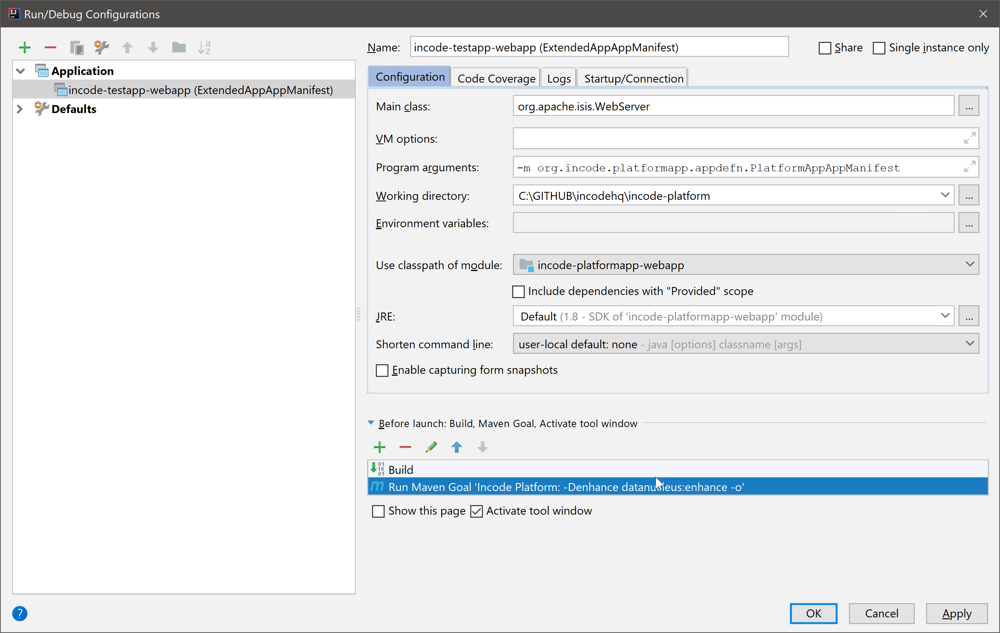

[[committers-guide]]
= Committers Guide
:_basedir: ../../
:_imagesdir: images/
:toc:

This guide contains procedures to be performed by committers/maintainers of this codebase.

[[build-process]]
== Build process

As described in the xref:../contributors-guide/contributors-guide.adoc#[contributors' guide], to build the platform simply use:

[source,bash]
----
mvn clean install
----

from the root directory.

If developing new versions of the platform, use the `platformapp` webapp project.
This can be run from the IDE in the usual way:

That is:

* use `org.incode.platform.appdefn.PlatformAppAppManifest`
+
as the app manifest implementation

* use `mvn -Denhance datanucleus:enhance` in the root directory
+
to enhance JDO entities prior to running the app.

Integration tests for individual modules can be run from the IDE; each modules integration tests resides in its own  Maven module.

[[interim-releases]]
== Interim Releases

As noted in the xref:../index.adoc#[home page], interim releases of the Incode Platform source are available at https://repo.incode.cloud[repo.incode.cloud].

To trigger new releases, all that is required is to set up gitlab repo as an alternate remote in `.git/config`:

[source]
----
[remote "gitlab"]
    url = https://gitlab.com/incodehq-public/incode-platform.git
    fetch = +refs/heads/*:refs/remotes/gitlab/*
----

Pushing to this remote will trigger a CI build that will automatically upload a new release to `repo.incode.cloud`.

== Release to Maven Central

This section describes the steps to release the platform to Maven central.
There are four step:

* release the modules

* recreate the quickstart archetype (referencing the just-released modules)

* release the quickstart archetype

The release process uses Sonatype's OSS support (see the "link:https://central.sonatype.org/pages/producers.html[producers]" user guide and associated subdocuments).
Our thanks to them for providing this service.

=== One-off Prereqs

Apply for access to release `org.incode`.

* create an account on link:https://issues.sonatype.org[issues.sonatype.org]
* create a ticket requesting permissions to release `incode.org`
+
Use https://issues.sonatype.org/browse/OSSRH-28156[OSSRH-28156] as a template.
Also of interest might be the original requests for `incode.org` (https://issues.sonatype.org/browse/OSSRH-18045[OSSRH-18045] and `isisaddons.org` (https://issues.sonatype.org/browse/OSSRH-10641[OSSRH=10641]).
* create a GPG key-pair and upload the public key to a public server
+
Full details of how to do this can be found in Sonatype's https://central.sonatype.org/pages/working-with-pgp-signatures.html[working-with-pgp-signatures] guide.

=== Pre-release Prereqs

Set the following environment variables:

[source,bash]
----
export INCODE_REL=1.16.3                                    # #<1>
export INCODE_NEXT=1.16.4-SNAPSHOT                          # #<2>
export INCODE_KEYID=dan@haywood-associates.co.uk            # #<3>
export INCODE_KEYPASS="this is not really my passphrase"    # #<4>

env | grep ^INCODE
----
<1> the version to be released.
Generally speaking this should correspond to the version of Apache Isis.
<2> for the next development version
<3> key id used when creating the GPG key pair
<4> corresponding pass phrase

=== Release Modules

Switch to the `modules` directory:

[source,bash]
----
pushd modules
----

If necessary, update the `incode-parent` module (in `modules/pom.xml`), so that it references the correct version of Apache Isis.

[source,xml]
----
<properties>
    <isis.version>1.16.3</isis.version>
    ...
</properties>
----

Commit these changes.

Then, release and tag using:

[source,bash]
----
mvn clean deploy               \
    -Ddeploy                   \
    -Ddeploy-modules           \
    -Dskip.default-modules     \
    -Drelease=$INCODE_REL      \
    -Dskip.isis-swagger        \
    -Dskip.isis-validate       \
    -Dpgp.secretkey=keyring:id=$INCODE_KEYID \
    -Dpgp.passphrase="literal:$INCODE_KEYPASS"

git tag $INCODE_REL
----

If the script completes successfully, then push changes and the tag:

[source]
----
git push origin master && git push origin $INCODE_REL
popd
----

=== Recreating the archetype

The quickstart archetype is re-created for each release from the current quickstart application.
The generated archetype is then released by deploying up to Maven Central.

If necessary, setup environment variables:

[source,bash]
----
export INCODE_REL=1.16.3
export INCODE_NEXT=1.16.4-SNAPSHOT

env | grep ^INCODE
----

Then, switch to the quickstart _application_:

[source,bash]
----
pushd archetype/app/quickstart
----

Now check the application source code:

* Confirm that the parent `pom.xml` of the quickstart application inherits from the release version of `org.incode:incode-parent`.
+
For example:

+
[source,xml]
----
<parent>
    <groupId>org.incode</groupId>
    <artifactId>incode-parent</artifactId>
    <version>1.16.3</version>
    <relativePath/>
</parent>
----

* Also check that the parent `pom.xml` references the release (non-SNAPSHOT) versions of `isis.version`:

+
[source,xml]
----
<properties>
    <isis.version>1.16.3</isis.version>
    ...
</properties>
----

Staying in the same directory, recreate using:

[source,bash]
----
sh ../../arch/recreate-archetype.sh $INCODE_REL
----

Finally, commit any changes:

[source,bash]
----
popd
git commit -am "recreates archetype for $INCODE_REL"
----

=== Releasing the archetype

We release in three steps:

* build the archetype locally (analogous to `mvn release:prepare`)
* check that an application can be built from the archetype
* deploy the archetype (using `mvn deploy`).

==== Prepare the archetype

The archetype is prepared using:

[source,bash]
----
pushd ex/arch/quickstart
sh ../release-prepare.sh $INCODE_REL
popd
----

==== Testing the archetype

In a _different session_:

First, setup environment variables:

[source,bash]
----
export INCODE_REL=1.16.3
export INCODE_TMP=/c/tmp    # or as required
export INCODE_ART=quickstart
env | grep INCODE | sort
----

then:

[source,bash]
----
rm -rf $INCODE_TMP/test-$INCODEART

mkdir $INCODE_TMP/test-$INCODEART
cd $INCODE_TMP/test-$INCODEART
----

also, delete any test artifacts that might be in local cache:

[source,bash]
----
rm -rf ~/.m2/repository/com/mycompany
----

Then, generate the app:

[source,bash]
----
mvn archetype:generate  \
    -D archetypeGroupId=org.incode.platform.archetype \
    -D archetypeArtifactId=quickstart-archetype \
    -D archetypeVersion=$INCODE_REL \
    -D groupId=com.mycompany \
    -D artifactId=myapp \
    -D version=1.0-SNAPSHOT \
    -D archetypeCatalog=local \
    -B
----

and build and run using:

[source,bash]
----
cd myapp
mvn clean install

mvn -pl webapp jetty:run \
    -Disis.appManifest=domainapp.appdefn.DomainAppAppManifestWithFixtures
----

Login using sven/pass.
The application generated should be the xref:../../quickstart/quickstart.adoc#[Quickstart app].

==== Deploying the archetype

Back in the original session (in the `archetype/arch/quickstart` directory), the archetype is released (deployed to Maven Central) using:

[source,bash]
----
pushd ex/arch/quickstart
sh ../release-deploy.sh    \
              $INCODE_NEXT \
              $INCODE_KEYID \
              "$INCODE_KEYPASS"
----

This script should automatically commit changes.
To finish up, just push:

[source,bash]
----
popd
git push
----

=== Update the website

Update the website where required.
In particular, update:

* running the archetype
** home page
** quickstart page
* change log

and republish (as described xref:committers-guide.adoc#docs-and-website[below]).

[[docs-and-website]]
== Docs & website

The website resides in the `adocs` directory:

* `documentation/` is the source for website itself (Asciidoctor)
* `template/` is the HTML template
* `search/` holds node.js Javascript files to index the built site so that it is searchable

The website is published to the `link:https://github.com/incodehq/incodehq.github.io[incodehq/incodehq.github.io]` github repository; a `CNAME` file (in the root directory) maps this to `link:https://platform.catalog.org[]`.

To publish, this repository must also be cloned to your local computer.
The scripts assume that the `incode-platform` repository (ie this repo) and the `incodehq.github.io` repository cloned at the same level, eg:

[monotree]
----
+
 + incodehq
  - incode-platform
  - incodehq.github.io
----

=== Prerequisites

Make sure that you've checked out the `incodehq/incodehq.github.io` repository alongside this one (see discussion above).

You'll also need to install:

* node (v7.10.0 or later) ... used to build the search index
* python 3 ... used to preview

The actual website generation uses AsciidoctorJ, which is called by Maven plugin.
There are no other software prereqs.

Normally you'll want to work in the `adocs/documentation` directory:

[source,bash]
----
pushd adocs/documentation
----

=== Previewing the website

To do a quick build the website and preview locally, use:

[source,bash]
----
sh preview-html.sh
----

This builds the HTML and the search index, but omits building the PDFs.
To enable you to preview the generated site, it starts a (python) webserver to browse.

To also build the PDFs, use:

[source,bash]
----
sh preview-pdf.sh
----

=== Publishing the website

When you are ready to publish the website, use:

[source,bash]
----
sh publish.sh
----

This will remove all files in the `incodehq.github.io` directory and replace with the latest build.

To check everything is ok:

[source,bash]
----
pushd ../../../incodehq.github.io
sh preview-html.sh
----

(or use `preview.sh` to also generate the PDFs).

If all looks ok, then just push the changes:

[source,bash]
----
git push
----

